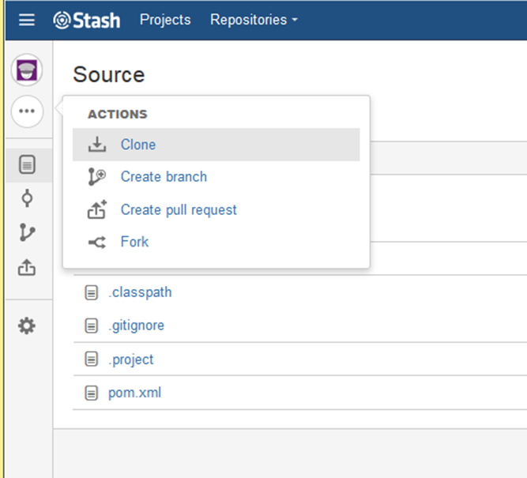
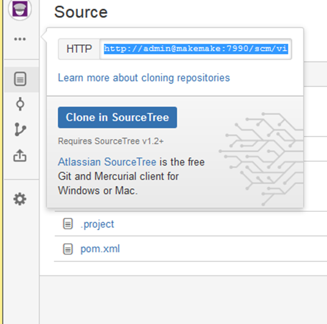

# Utilisation de git

### importer un projet git dans Eclipse

1. Depuis Stash

Se rendre sur le projet dans stash <http://makemake:7990/projects>
Choisir le dépôt

Cliquer sur cloner puis choisir Clone

Cliquer sur Clone in Source Tree

Aller sur eclipse

Choisir le dépôt

